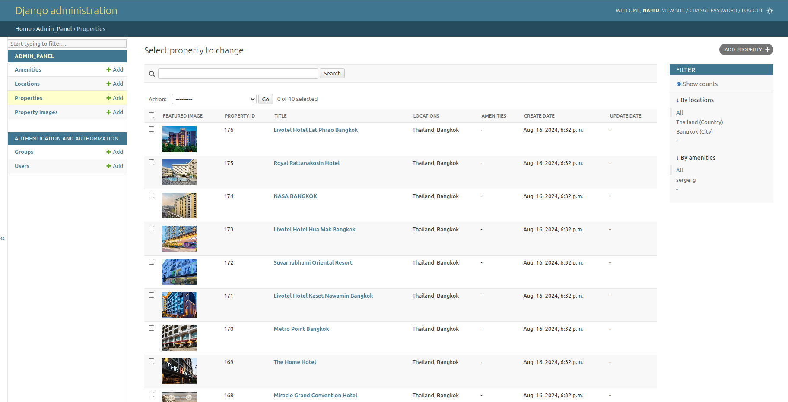
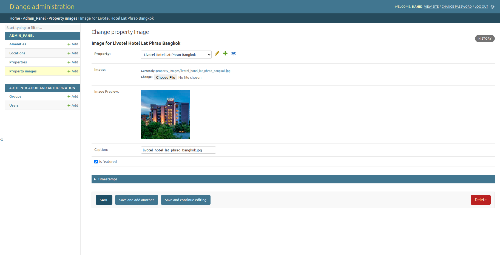

# Hotel Details Project
> This Django-based project manages hotel details, including locations, amenities, and property information. It includes an admin panel for data management and a custom data migration tool for importing data from a Scrapy database.

[](https://github.com/Speak2/Django_assignment/graphs/commit-activity)
[](https://github.com/Speak2/Django_assignment/issues)


## Table of Contents
1. [Prerequisites](#prerequisites)
2. [Installation](#installation)
3. [Configuration](#configuration)
4. [Running the Project](#running-the-project)
5. [Database Migrations](#database-migrations)
6. [Admin Panel](#admin-panel)
7. [Data Migration](#data-migration)
8. [Project Structure](#project-structure)
9. [Development Tools](#development-tools)


## Project Structure

- `admin_panel/`: Main application for the admin interface
- `data_migration_cli/`: Custom management command for data migration
- `hotel_details_project/`: Project settings and configuration
- `static/`: Static files (CSS, JavaScript)
- `property_images/`: Uploaded property images

   ```bash
   Django_assignment/
   │
   ├── admin_panel/                       
   │   ├── admin.py 
   │   ├── apps.py
   │   ├── models.py
   │   └── views.py
   ├── data_migration_cli/                    
   │   └── management          
   │      └── commands    
   │          └── migrate_scrapy_data.py 
   ├── hotel_details_project/          
   │   ├── settings.py 
   │   ├── urls.py
   │   └── wsgi.py 
   ├── static/
   │   └── js/
   │       └── admin    
   │           ├── image_preview.js
   │           └── property_image_preview.js
   ├── README.md         
   └── LICIENSE            
   ```


## Requirements  (Prerequisites)
Tools and packages required to successfully install this project.
For example:
- Python 3.x
- Django
- PostgreSQL

## Installation

1. Clone the repository:
   ```bash
   git clone https://github.com/Speak2/Django_assignment
   cd Django_assignment
   ```

2. Create a virtual environment:
   ```bash
   python -m venv venv
   source venv/bin/activate  # On Windows use `venv\Scripts\activate`
   ```

3. Install the required packages:
   ```bash
   pip install -r requirements.txt
   ```
4. before running this project run the **`updated scrapy_project`**

   github repository -  


## Configuration

1. Open `hotel_details_project/settings.py` and configure your database settings:
   ```python
   DATABASES = {
       'default': {
           'ENGINE': 'django.db.backends.postgresql',
           'NAME': 'your_database_name',
           'USER': 'username',
           'PASSWORD': 'password',
           'HOST': 'localhost',
           'PORT': 'port_number',
       }
   }
   ```

   Adjust these settings according to your PostgreSQL configuration.

2. Set the `SECRET_KEY` in `settings.py` to a secure value for production use.


3. Set the Base Directory Path for Scrapy Spider Images.
   In the `django/data_migration_cli/migrate_scrapy_data.py` file, you need to specify the base directory path where images saved by the Scrapy spider are located.

   - Open the migrate_scrapy_data.py file.

   - Locate line 118.

   - Update the full_path variable to point to the base directory of your Scrapy project's images. Replace the existing path with the path to your Scrapy project's image base directory:
      ```python
      full_path = os.path.join(
         '/home/w3e02/Documents/hello/'
         'web_crawler/dynamic_crawling/hotel_images',
         *path_parts
      )  # strictly follow the example or else it might not work
      ```
## Screenshots
This is the register information of the property details followed by upload images for each hotels






 
## Hotel Details Project - Key Features

- **Data Management**
  - Location (countries, states, cities) with geocoding
  - Amenities
  - Properties with multi-location and amenity associations
  - Property images with featured image functionality

- **Admin Panel**
  - Customized admin interface for all models
  - Image preview and management
  - List filters and search functionality

- **Data Migration Tool**
  - Custom command for Scrapy to Django data import
  - Dry-run option for testing

- **User Authentication**
  - Admin user management

- **File Management**
  - Static file serving (CSS, JavaScript, images)
  - Media file handling for uploaded images

- **Database**
  - PostgreSQL integration

- **Development Tools**
  - flake8 linter support
  - autopep8 integration for code formatting

- **Security Features**
  - CSRF protection
  - Configurable secret key

- **Internationalization**
  - Built-in i18n support

- **Time Zone Support**
  - Configured for Asia/Dhaka (customizable)


## Running the Project

1. Apply database migrations:
   ```
   python manage.py migrate
   ```

2. Create a superuser:
   ```
   python manage.py createsuperuser
   ```

3. Start the development server:
   ```
   python manage.py runserver
   ```

4. Access the application at `http://127.0.0.1:8000/`

## Database Migrations

After making changes to the models, run the following commands:

```
python manage.py makemigrations
python manage.py migrate
```

## Admin Panel

Access the admin panel at `http://127.0.0.1:8000/admin/` using the superuser credentials.

## Data Migration

To migrate data from the Scrapy database to Django, use the custom management command:

```
python manage.py migrate_scrapy_data
```

Use the `--dry-run` option to test the migration without making changes:

```
python manage.py migrate_scrapy_data --dry-run
```


## Development Tools

- Linter: flake8 (install from VS Code extension store)
- Code formatter: autopep8 (install from VS Code extension store)

Remember to run the linter and formatter regularly to maintain code quality.

## Authors
This project is for Django admin panel practice created by me for assignment purposes during my internship days at w3 egnineers ltd. 
 
Nahid Mahamud  – nahid.nm91@gmail.com
 
 You can find me here at:
[Github](https://github.com/Speak2) 


## License
A short snippet describing the license (MIT, Apache etc).

This project is licensed under the MIT License - see the LICENSE.md file for details

MIT © Nahid Mahamud


1-> i installed django using requirements.txt
2-> create a django project using- django-admin startproject <project-name>
3-> run the server using - python manage.py runserver
4-> create a super user - python manage.py createsuperuser

install linter flake8 from extension store
install autopep8 extension from extension store

when you make any changes to the model you have to do database migration to imply the effects

python manage.py makemigrations
python manage.py migrate

in-order to run the migrator cli command use-
python manage.py migrate_scrapy_data